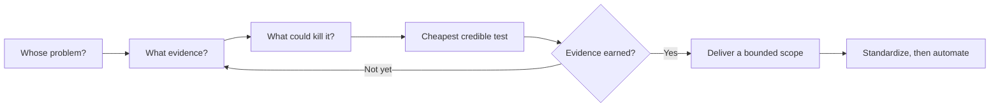

# Solo Operator

### Stop collecting ideas. Start collecting evidence.

A Codex skill for one-person businesses. Turn a promising idea, scattered research,
or a noisy launch into one concrete decision and the cheapest credible next test.

[](https://github.com/beukkung/solo-operator/actions/workflows/validate.yml)
[](LICENSE)
[](evals/REPORT.md)

<div align="center">
  
  <br />
  <sub><strong>Evidence before effort.</strong> A small signal, a bounded experiment, a decision you can defend.</sub>
</div>

> **Maximize evidence gained per founder-hour.**

You have a weekend, a small budget, and an idea for an AI dashboard. The hard part
is deciding what deserves your weekend. Solo Operator pushes the conversation
toward a real customer, observable demand, delivery economics, and a bounded test.
When customers have already paid for a viable scope, it helps you get on with delivery.

**No runtime dependencies. No required business folders. No API key needed for the
skill itself.** Uses your existing Codex access.

<table>
  <tr>
    <td width="33%"><strong>01 · Signal</strong><br />Find the behavior, payer, and real cost of the problem.</td>
    <td width="33%"><strong>02 · Test</strong><br />Run the smallest credible experiment before building the system.</td>
    <td width="33%"><strong>03 · Decide</strong><br />PURSUE, TEST, WATCH, DEPRIORITIZE, or KILL with evidence attached.</td>
  </tr>
</table>

## Install in Codex

Ask Codex:

```text
Use $skill-installer to install the skill from
https://github.com/beukkung/solo-operator/tree/v0.1.0/skills/solo-operator
```

The skill is available on the next turn. Invoke it explicitly with `$solo-operator`;
normal automatic selection is also enabled for relevant business questions.

<details>
<summary>Manual installation — Windows, macOS, and Linux</summary>

Clone the release, then copy only the skill folder into your global Codex skills
directory. The commands stop if an installation already exists; compare it before
updating. If `CODEX_HOME` is configured, that location takes precedence.

**Windows PowerShell**

```powershell
git clone --branch v0.1.0 --depth 1 https://github.com/beukkung/solo-operator.git
$skillHome = if ($env:CODEX_HOME) { $env:CODEX_HOME } else { Join-Path $env:USERPROFILE '.codex' }
$skillTarget = Join-Path $skillHome 'skills/solo-operator'
if (Test-Path -LiteralPath $skillTarget) { throw 'Skill already exists; compare before updating.' }
New-Item -ItemType Directory -Force -Path (Join-Path $skillHome 'skills') | Out-Null
Copy-Item -LiteralPath './solo-operator/skills/solo-operator' -Destination $skillTarget -Recurse
```

**macOS / Linux (Bash or Zsh)**

```sh
git clone --branch v0.1.0 --depth 1 https://github.com/beukkung/solo-operator.git
skill_target="${CODEX_HOME:-$HOME/.codex}/skills/solo-operator"
if [ -e "$skill_target" ]; then
  printf '%s\n' 'Skill already exists; compare before updating.'
else
  mkdir -p "$(dirname "$skill_target")"
  cp -R ./solo-operator/skills/solo-operator "$skill_target"
fi
```

To uninstall, remove only the installed `solo-operator` folder. For updates,
compare the new release with your local copy and preserve any local customization.

</details>

## Try it in one minute

**Evaluate an idea**

```text
Use $solo-operator. I have 8 hours a week and $300. I want to build an AI
dashboard for independent fitness coaches. I haven't spoken to any coaches.
What evidence should I get before I build, and what should I do this week?
```

**Price a service**

```text
Use $solo-operator. Two retailers shared messy spreadsheets with me. I can
clean one in roughly four hours. Nobody has paid yet. Help me propose a
small paid pilot and decide what would make the economics worth pursuing.
```

**Choose the next experiment**

```text
Use $solo-operator. My comparison page got 2,000 visits, 180 merchant clicks,
9 purchases, and $72 in approved commissions. Hosting cost $8 and I spent
12 hours. Should I write more articles, improve the offer, or stop?
```

Add your available hours, actual spending or payments, customer behavior, and
current commitments. You can ask in your preferred language.

## How it thinks



| Principle | What changes in the conversation |
| --- | --- |
| Operator Ladder | Stop at the first unanswered question that changes the decision. |
| Evidence Ladder | Distinguish a like, a conversation, a shared artifact, a deposit, and a renewal. |
| One-Person Test | Account for founder hours, margins, support, reach, and delivery burden. |
| Build Gate | Build only what the evidence or the cheapest meaningful experiment justifies. |
| Clear verdict | End opportunity decisions with **PURSUE**, **TEST**, **WATCH**, **DEPRIORITIZE**, or **KILL**. |

The usual answer connects **what we know → what we think → what we don't know →
why it matters → the highest-value uncertainty → the cheapest credible test**.
It labels proposed prices and thresholds as proposals, not market facts.

If your project has `STATE.md`, operating rules, research, or a decision log, the
skill consults the relevant current context. If it does not, it works from what
you provide. It does not create a business operating system just to answer a question.

## Evidence you can inspect

An actual response to the unvalidated-dashboard case:

> “Provisional decision rule: one payment earns one delivery, not a dashboard.”

And when three customers have already paid deposits:

> “The highest-value uncertainty is now **whether you can deliver acceptable results within scope at an hourly return worth repeating**.”

These are excerpts from the stored evaluation responses, not invented testimonials.
The first earns a demand test; the second earns delivery.

For a quick read, start with the [simple scorecard](evals/SIMPLE_REPORT.md). It
asks three plain questions—evidence, a bounded founder-fit test, and a decision
that follows the evidence—then links every case to the full response. The
[behavioral report](evals/REPORT.md) contains the complete eight-case run, raw
answers, metadata, and per-case scoring rationale. The [rubric](evals/RUBRIC.md)
was defined before the original runs.

The simple scorecard summarizes the existing run; it does not make a new model
claim. In that run, strong experiment design appeared in 3/8 baseline answers
and 7/8 skill answers. Both arms handled evidence in 8/8 cases, and the skill
had one decision-focus regression in the idea-sprawl case.

| Quick check | No skill | With Solo Operator |
| --- | ---: | ---: |
| Evidence separated from uncertainty | 8/8 | 8/8 |
| Bounded, founder-fit next test | 3/8 | 7/8 |
| Decision follows evidence | 8/8 | 7/8 |
| All three together | 3/8 | 6/8 |

These are secondary summaries of one unblinded synthetic run. Open the
[simple scorecard](evals/SIMPLE_REPORT.md) for definitions, case links, and limits.

Package checks and model behavior are separate. The CI badge verifies packaging;
the scorecards evaluate decision quality. This is a small, unblinded AI review,
not a claim of statistically proven improvement or profitable business outcomes.

See [how to reproduce the evaluation](evals/README.md),
[release notes](docs/releases/v0.1.0.md), and the [skill itself](skills/solo-operator/SKILL.md).

## Make it better

Found a case where it chased the wrong uncertainty, overbuilt, or stalled a paying
customer? [Open a behavior issue](https://github.com/beukkung/solo-operator/issues/new/choose)
with an anonymized prompt and the decision it missed. Realistic counterexamples
are more useful than extra rules.

See [CONTRIBUTING.md](CONTRIBUTING.md). MIT licensed; use it, adapt it, and keep the
license notice. Created by [beukkung](https://github.com/beukkung).
